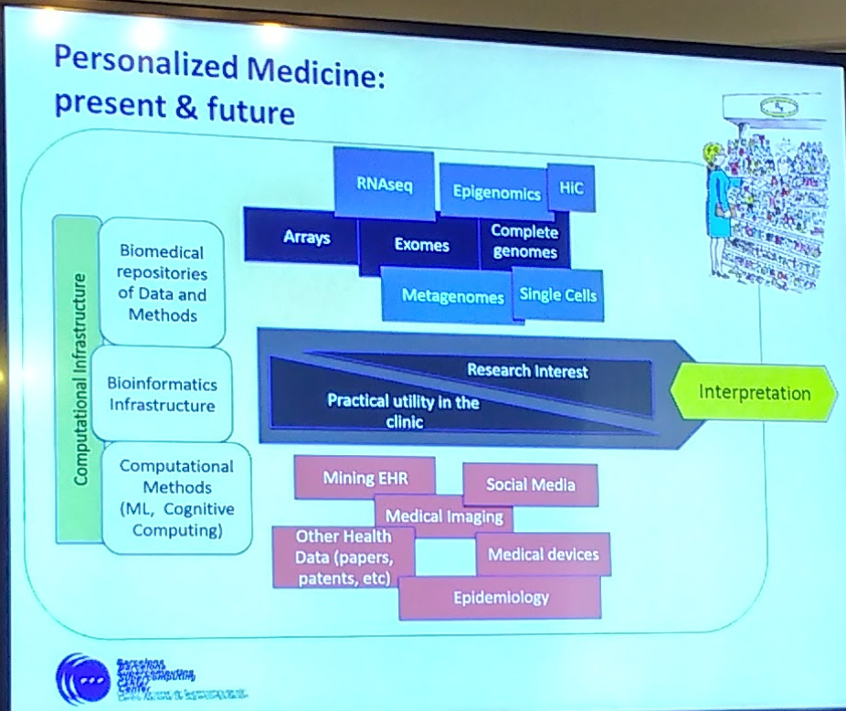
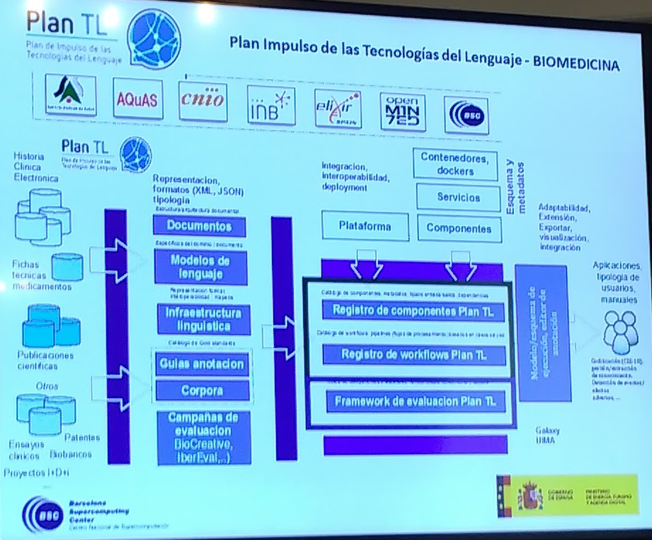
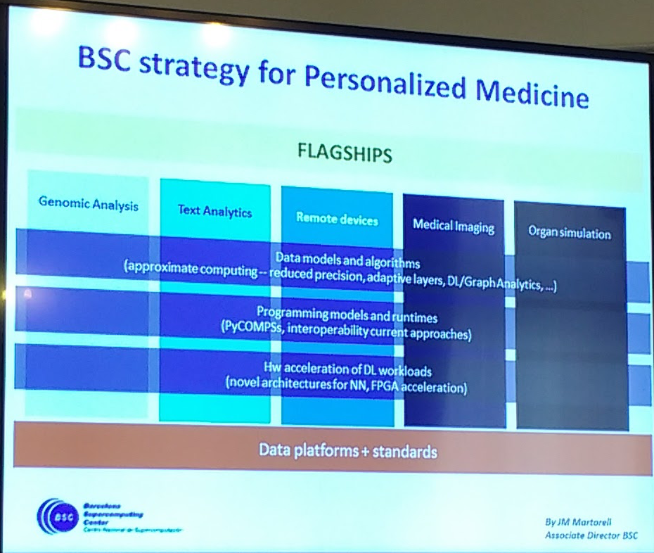
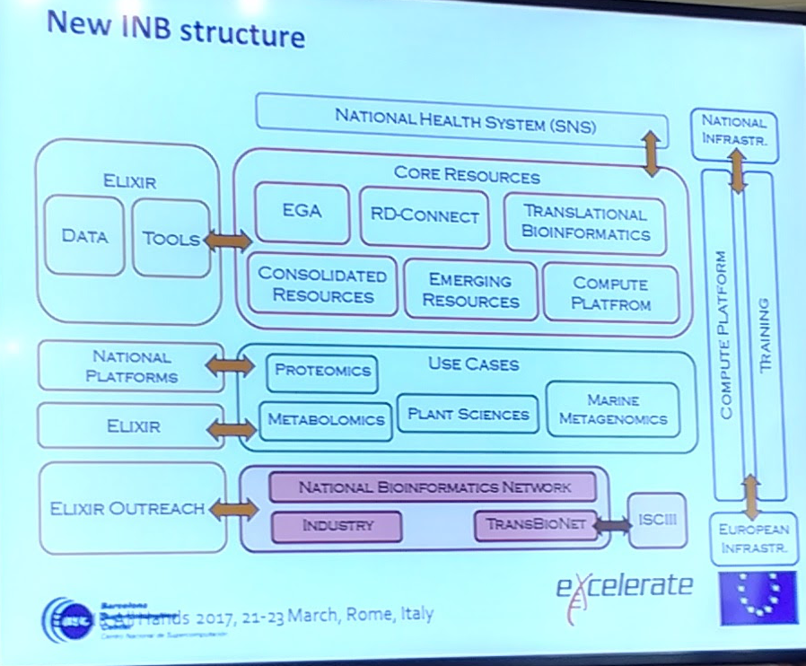

> [<- Back to index](README.md)

# Introduction. Bioinformatics in genomic projects. The INB and ELIXIR

> Alfonso Valencia, Coordinador del INB, Barcelona Supercomputing Center

> Wednesday, August 2.

Reference: [ASCO - Precision Medicine Yields Better Outcomes for Patients in Phase I Clinical Trials - 2017-04-15](references/ASCO_Precision_Medicine.pdf)

- [23andMe](https://www.23andme.com/)
- [Deep Sequencing of 10,000 Human Genomes](https://www.ncbi.nlm.nih.gov/pubmed/27702888)
- [HUMAN LONGEVITY, INC](http://www.humanlongevity.com/)
- [The Health Nucleus](https://www.healthnucleus.com/)
- [Calico](https://www.calicolabs.com/)
- [A wellness study of 108 individuals using personal, dense, dynamic data clouds](http://www.nature.com/nbt/journal/vaop/ncurrent/full/nbt.3870.html?foxtrotcallback=true)

## Bioinformatics for personalized medicine
- Genome analysis
- Consequences of alterations: SNPs, CNVs, miRNA, Epigenetics
- Phenotypic and pathways analysis
- Drug relation. Proteins, genes pathways

- [Getting personalized cancer genome analysis into the clinic: the challenges in bioinformatics](https://www.ncbi.nlm.nih.gov/pubmed/22839973)
- [Big Data: Astronomical or Genomical?](http://journals.plos.org/plosbiology/article?id=10.1371/journal.pbio.1002195)

> Bioinformatics is the limiting factor.

Prediction of disease & targeted prevention > Early identification of disease > Precise diagnosis > Targeted interventions > Improves outcomes > €

- [NHS England - Personalised Medicine](https://www.england.nhs.uk/healthcare-science/personalisedmedicine/)

## Personalized medicine: present & future

- [International network of cancer genome projects](https://www.ncbi.nlm.nih.gov/pubmed/20393554)
- [Non-coding recurrent mutations in chronic lymphocytic leukaemia](https://www.ncbi.nlm.nih.gov/pubmed/26200345)
- [PCAWG: PanCancer Analysis of WHOLE GENOMES](https://github.com/ICGC-TCGA-PanCancer)

## Resources

- The genomehenge: Sequencing
- [Plan de Impulso de las Tecnologías del Lenguaje - BIOMEDICINA](http://www.agendadigital.gob.es/tecnologias-lenguaje/Paginas/plan-impulso-tecnologias-lenguaje.aspx)
- [EuroHPC](http://eurohpc.eu/)
  - PerMed Testbed
- [ELIXIR: A distributed infrastructure for life-science information](https://www.elixir-europe.org/)
  
  - [ELIXIR - GA4GH Beacon project](http://www.ga4gh.org/#/beacon)

- IHEC
- RD Connect
- [European Genome-Phenome archive](https://ega-archive.org/)
- IRDiRC
- CLL
- ...

- [INB/ELIXIR-ES](http://www.inab.org/about/inb-in-elixir/)

### New INB structure

- [PsyGeNET](http://www.psygenet.org/web/PsyGeNET/menu;jsessionid=1ct77mwy23lu68cqyvdwe61q9)
- [DisGeNET](http://www.disgenet.org/web/DisGeNET/menu;jsessionid=n62wbr1c6o9g167jwl5jbs87o)
- Transbionet
- [Training: Annual BIOINFORMATICS CONFERENCE](http://jbi2016.webs.upv.es/)
