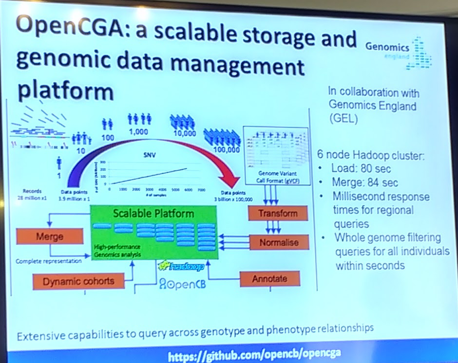

> [<- Back to index](README.md)

# Analysis of genomes, RNAseq and others

> Joaquín Dopazo, INB, Fundación Progreso y Salud

> Wednesday, August 2.

"_Progress in science depends on new techniques, new discoveries and new ideas, probably in that order._"

## Background: The transition to precision medicine

    Intuitive: Based on trial and error -->
    Identification of probabilistic patterns -->
    Decisions and actions based on knowledge

Precision medicine is based on a better knowledge of phenotype-genotype relationships.

## Out observational tools: Different omic Data

    Genomics, Epigenomics, Transcriptomics, Proteomics, Metabolomics

The principle: comparison of patients to reference controls or segregation within families.

## Pipeline of data analysis

| Primary processing | Secondary analysis (Heuristic filtering) | Knowledge-based priorization |
| ---- | ---- | ---- | ---- |
| Initial QC - FASTQ file | Variant annotation - Filtering by effect | Proximity to other known disease genes |
| Mapping - BAM FILE | Filtering by MAF | |

Priorization applications: making the priorization report interactive
- [BIER Tool](https://github.com/babelomics/biertool) [BierApp](http://bierapp.babelomics.org/)
- [Genome Maps](http://www.genomemaps.org/)

## OpenCGA

[OpenCGA](https://github.com/opencb/opencga): An Open Computational Genomics Analysis platform for big data processing and analysis in genomics.

----

## [CSVS Project](http://csvs.babelomics.org/)
CSVS was created to provide information about the variability of the Spanish population to the scientific/medical community. It is useful for filtering polymorphisms and local variations in the process of prioritizing candidate disease genes. CSVS currently stores information on 790 unrelated Spanish individuals. We accept submissions from WES or WGS. See the protocol for sending samples.

## Why binning data into ICD-10 categories?
ICD-10 first levels of diseases offer two advantages:
- No (or very low) common genetic background among ICD categories.
- Classes big enough to preserve data confidentiality. Attempts to identify individuals within them will produce very vague phenotype clues.

Binning into ICD-10 high level categories endorsed by CIBERER experts in bioethics.

----

### The NaGen project
An initiative to sequence 1000 genomes of patients with rare and familiar diseases in Navarra inspired in the GEL.

----

### The CIBERER initiative for diagnosis and biomarker discovery

- [Team](http://team.babelomics.org/)
- [BiERapp](http://bierapp.babelomics.org/)

## Strategic action for personalized medicine in Andalucía

----

[Gene Ontology](http://www.geneontology.org/)

----

[SNOW, a web-based tool for the statistical analysis of protein-protein interaction networks.](https://www.ncbi.nlm.nih.gov/pubmed/19454602)

----

### Pathway databases

- [KEGG](http://www.genome.jp/kegg/)
- [Reactome](http://reactome.org/)
- Biocarta

- [PathACT](http://pathact.babelomics.org/): ACTIONABLE PATHWAY WORKSHOP

----

> [Bioinformatic Department Tools](http://bioinfo.cipf.es/tools)
