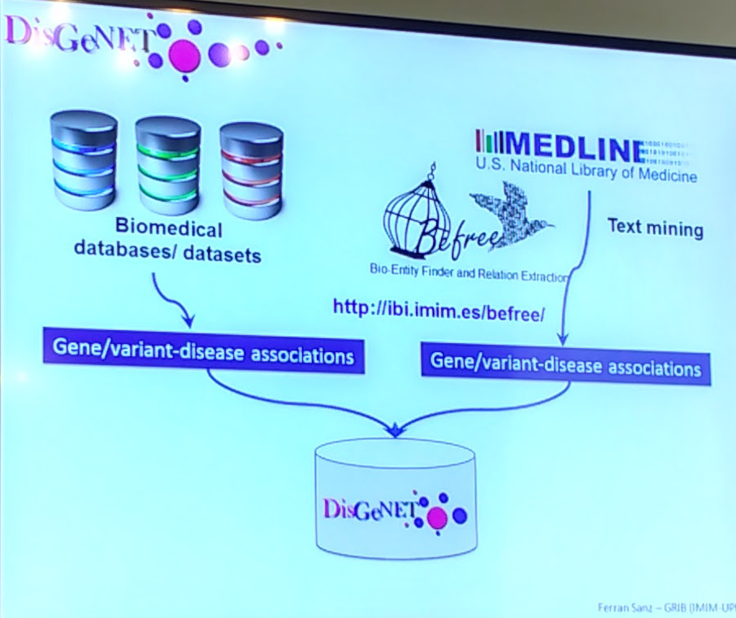
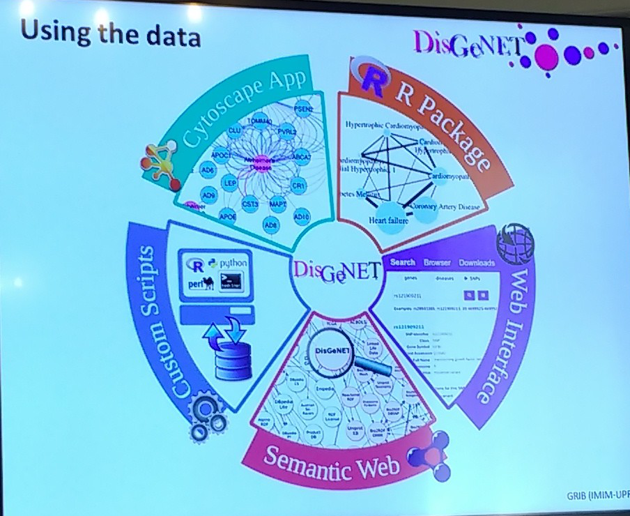

> [<- Back to index](README.md)

# Analysis of relationships between diseases and genes

> Ferrán Sanz, INB, Instituto de Investigación del Hospital del Mar

> Wednesday, August 2.

## Genetic basis of diseases
- Monogenic diseases = ```f (variation in a single gene)```
  - ... but other genes may modify the clinical manifestation of the disease
- Complex diseases = ```f (genetic factors; lifestyle; environment)```


The availability of **comprehensive, traceable, high quality** data on **genotype-phenotype associations (GDA)** is key to understand the molecular mechanisms of human diseases.

## [DisGeNET](http://www.disgenet.org/)
- [DisGeNET: a comprehensive platform integrating information on human disease-associated genes and variants](https://academic.oup.com/nar/article/45/D1/D833/2290909/DisGeNET-a-comprehensive-platform-integrating)
- [DisGeNET: a discovery platform for the dynamical exploration of human diseases and their genes](https://www.ncbi.nlm.nih.gov/pmc/articles/PMC4397996/)



- Text mining tool: [BeFree](http://ibi.imim.es/befree)

### The data sources
#### Curated data sources
- [UniProt](http://www.uniprot.org/)
- [CTD](http://ctdbase.org/): Comparative Toxicogenomics Database
- [Orphanet](http://www.orpha.net/consor/cgi-bin/index.php)
- [GWAS Catalog](https://www.ebi.ac.uk/gwas/)
- [ClinVar](https://www.ncbi.nlm.nih.gov/clinvar/)
- [HPO](http://human-phenotype-ontology.github.io/)
- [PysGeNET](http://www.psygenet.org/)

##### The data sources: curation process
    Text mining > [TM Results] > Guidelines > Experts > Annotation tool > [Annotations] > Results

[Text mining and expert curation to develop a database on psychiatric diseases and their genes](https://www.ncbi.nlm.nih.gov/pmc/articles/PMC5502359/)

#### Animal models
- [Mouse genome informatics](http://www.informatics.jax.org/)
- [Rat genome informatics](http://rgd.mcw.edu/)
-CTD

#### Text mining
- LHGDN
- GAD
- BEFREE

----

[Semanticscience Integrated Ontology (SIO)](https://github.com/micheldumontier/semanticscience)

----



> [disgenet2r](https://bitbucket.org/ibi_group/disgenet2r)

- [ChEMBL](https://www.ebi.ac.uk/chembl/)
- [PHAROS Tdark](http://commonfund.nih.gov/idg)

----

[IBI Group](http://ibi.imim.es/)
