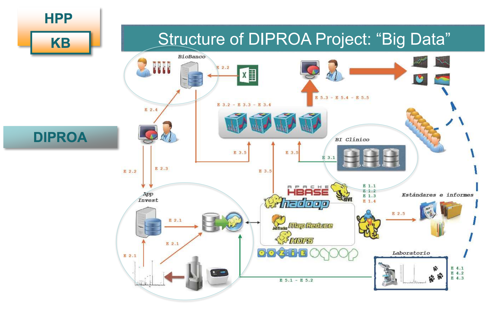

> [<- Back to index](README.md)

# Proteomics applied to rheumatic diseases

> Francisco Blanco, ProteoRed, Instituto de Investigación Biomédica de A Coruña

> Friday, August 4.

[DIPROA Project](http://www.proteored.org/documents/10180/127668/Prote%C3%B3mica+cl%C3%ADnica+de+las+enfermedades+reum%C3%A1ticas+en+el+marco+del+HPP_FJBlanco.pdf/cda3a599-99b4-4c45-abce-34f987d57a35;jsessionid=0462A990C52BA226F4349DEB5253E87A?version=1.0&previewFileIndex=)

